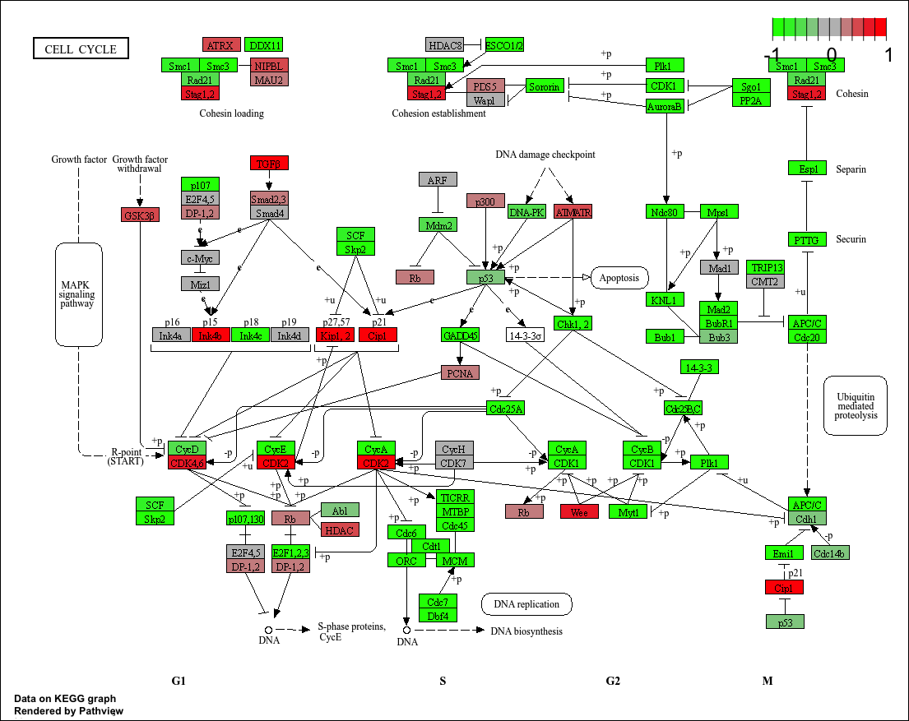
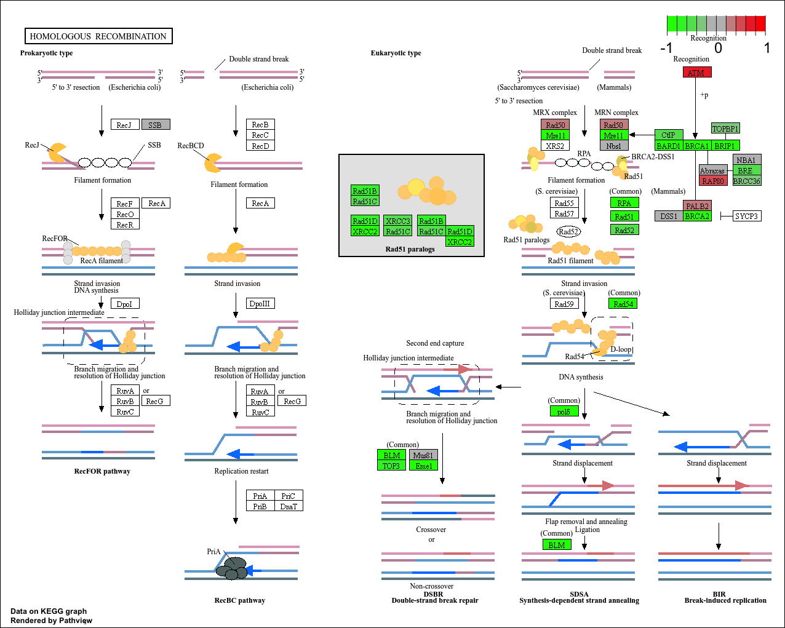

## Background

The data for today's mini-project comes from a knock-down study of an important HoX gene

## Data Import

```{r}
countFile <- "GSE37704_featurecounts.csv"
metaFile <- "GSE37704_metadata.csv"
countData <- read.csv(countFile, row.names=1)

colData <- read.csv(metaFile, row.names=1)
```

### Cleanup (data tidying)

```{r}
countData <- countData[, -1]

to.keep <- rowSums(countData) > 10

countData <- countData[to.keep, ]
```

We need to remove the length column from our `countData` to make the columns match the rows in `colData`
```{r}
head(countData)
head(colData)
ncol(countData) == nrow(colData)
```

## DESeq Analysis

```{r, message=F}
library(DESeq2)
```

### Setting up the input object
```{r}
dds <- DESeqDataSetFromMatrix(countData = countData,
                       colData = colData,
                       design = ~condition)
```

### Running DESeq 
```{r}
dds <- DESeq(dds)
```

### Getting results
```{r}
res <- results(dds)
head(res)

write.csv(res, "results.csv")
```

## Volcano Plot

```{r}
library(ggplot2)

ggplot(res)+
  aes(log2FoldChange,
      -log(padj))+
  geom_point() +
  geom_vline(xintercept = c(-2,+2), col = "red") +
  geom_hline(yintercept = -log(0.05), col = "red")
```

```{r}
mycols <- rep("gray", nrow(res) )
mycols[ res$log2FoldChange > 2] <- "blue"
mycols[ res$log2FoldChange < -2] <- "darkgreen"
mycols[res$padj >= 0.05] <- "gray"
```

```{r}
ggplot(res)+
  aes(log2FoldChange,
      -log(padj) )+
  geom_point(col = mycols) +
  geom_vline(xintercept = c(-2,+2), col = "red") +
  geom_hline(yintercept = -log(0.05), col = "red") +
  labs(
    title = "Knockdown of HoX gene",
    x = "Log2 Fold Change",
    y = "-Log Adjusted P-value"
  ) 
```
## Add Annotation (gene symbols and entrez ids)

```{r}
library(AnnotationDbi)
library(org.Hs.eg.db)
```

```{r}
columns(org.Hs.eg.db)

res$symbol <- mapIds(org.Hs.eg.db,
                    keys = rownames(res), # our ids
                    keytype = "ENSEMBL",# their format
                    column = "SYMBOL") # what i want to translate to

res$entrez <- mapIds(org.Hs.eg.db,
                    keys = rownames(res), # our ids
                    keytype = "ENSEMBL",# their format
                    column = "ENTREZID") # what i want to translate to

res$name <- mapIds(org.Hs.eg.db,
                    keys = rownames(res), # our ids
                    keytype = "ENSEMBL",# their format
                    column = "GENENAME") # what i want to translate to

res = res[order(res$pvalue),]
write.csv(res, file="deseq_results.csv")

head(res)
```

## Pathway Analysis

```{r, message=F}
library(gage)
library(gageData)
library(pathview)
```

```{r}
foldchanges <- res$log2FoldChange
names(foldchanges) <- res$symbol
head(foldchanges)
```

### KEGG
```{r, message=FALSE}
data(kegg.sets.hs)

names(foldchanges) <- res$entrez
keggres = gage(foldchanges, gsets=kegg.sets.hs)
head(keggres$less, 5)
```
```{r, eval=FALSE}
pathview(foldchanges, pathway.id = "hsa04110")
pathview(foldchanges, pathway.id = "hsa04114")
pathview(foldchanges, pathway.id = "hsa03030")
pathview(foldchanges, pathway.id = "hsa05130")
pathview(foldchanges, pathway.id = "hsa03440")
```






### GO

```{r, eval=FALSE}
data(go.sets.hs)
data(go.subs.hs)

gobpsets = go.sets.hs[go.subs.hs$BP]

gobpres = gage(foldchanges, gsets=gobpsets)

head(gobpres$less)
```

### Reactome
```{r}
sig_genes <- res[res$padj <= 0.05 & !is.na(res$padj), "symbol"]
print(paste("Total number of significant genes:", length(sig_genes)))

write.table(sig_genes, file="significant_genes.txt", row.names=FALSE, col.names=FALSE, quote=FALSE)
```

> Q: What pathway has the most significant “Entities p-value”? Do the most significant pathways listed match your previous KEGG results? What factors could cause differences between the two methods?

Cell Cycle Mitotic, The most significant pathways more or less match up with the previous KEGG results. Something that might cause differences between the two methods is how the two methods group results and differences and how specific they are. In KEGG cell cycle is just one result whereas in Reactome its split into many. 

