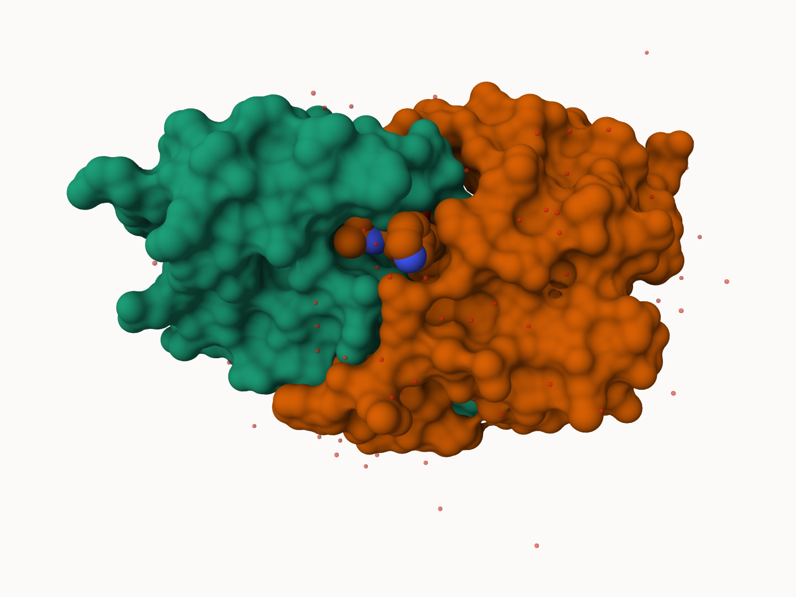
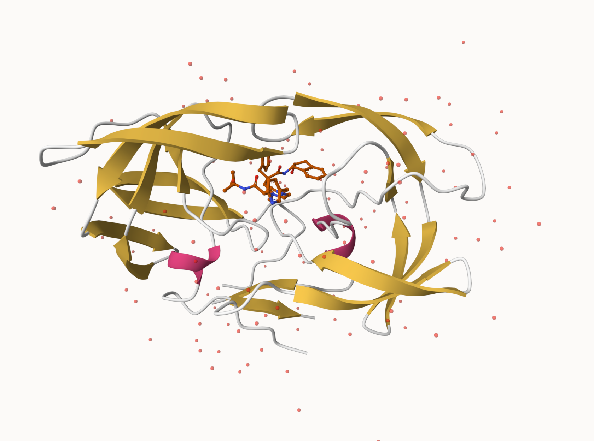
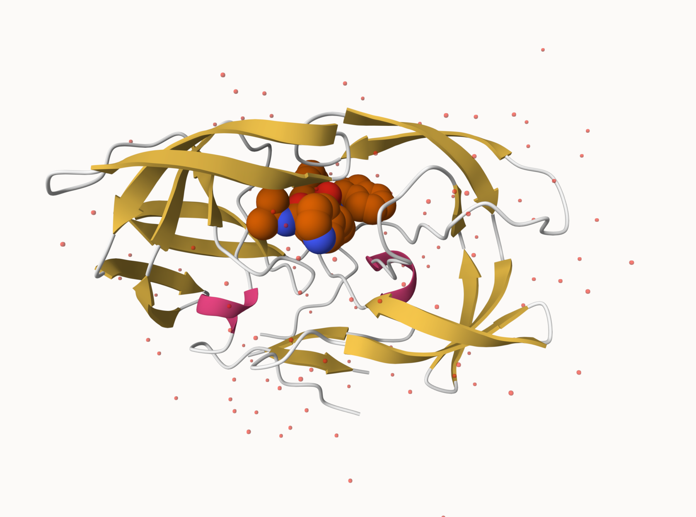
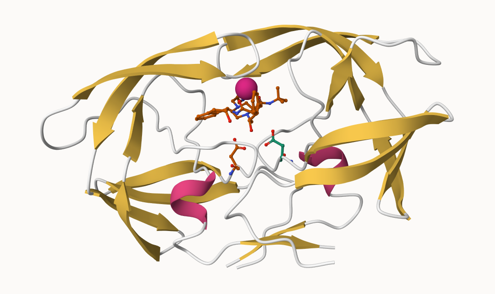

## The PDB database

The [Protein Data Bank (PDB)](http://www.rcsb.org/) is the main repository of biomolecular structure data. Let's see what is in it.

> Q1: What percentage of structures in the PDB are solved by X-Ray and Electron Microscopy.

~94%

> Q2: What proportion of structures in the PDB are protein?

214078 / 249018 = ~86%

```{r}
stats <- read.csv("pdbstats26", row.names = 1)
stats
```

```{r}
n.sums <- colSums(stats)
n <- n.sums/n.sums["Total"] 
round(n, digits=2)
```
> What is the total number of entries in the PDB?

```{r}
n.sums["Total"]
```

## Using Molstar

We can use the main [Molstar viewer online](https://molstar.org/viewer/):  



> Generate and insert an image of the HIV-Pr cartoon colored by secondary structure, showing the inhibiotr (ligand) in ball and stick. 



> Generate and insert an image of the HIV-Pr cartoon colored by secondary structure, showin gthe inhibitor (ligand) in spacefill.



> One final image showing catalytic APS 25 as ball and stick and the all-important active site water molecules as spacefill



## The Bio3D package fpor structural bioinformatics

```{r}
library(bio3d)

hiv <- read.pdb("1hsg")
hiv
```

```{r}
head(hiv$atom)
```

```{r}
pdbseq(hiv)
```

Lets try out hte new **bio3dview** package that is not yet on CRAN. 
We can use the **remotes** package to install any R package from GitHub 

## Quick viewing of PDB

```{r}
library(bio3dview)
sele <- atom.select(hiv, resno=25)
#view.pdb(hiv, backgroundColor = "pink",
 #        highlight = sele,
  #       highlight.style = "spacefill")
```

## Prediction of Protein flexibility
```{r}
adk <- read.pdb("6s36")
m <- nma(adk)
plot(m)
```

Write out our results as a trajectory movie:

```{r}
mktrj(m, file="results.pdb")
```

```{r}
#view.nma(m)
```

## Comparitive protein structure analysis with PCA

We start with a database id "1ake_A"

```{r}
library(bio3d)


id <- "1ake_A"

aa <- get.seq(id)
```

```{r}
aa
```

```{r}
blast <- blast.pdb(aa)
```

have a look
```{r}
head (blast$hit.tbl)
```

```{r}
hits <- plot(blast)
```
```{r}
head(hits$pdb.id)
```

Now we can download these top hits these will all be ADK structures in the PDB database

```{r}
files <- get.pdb(hits$pdb.id, path = "pdbs", split=TRUE, gzip=TRUE)
```

We need one package from BioConductor. To set this up we need to first install a package called **`BiocManager`** from CRAN

Now we can use the `install()` function from this package like this: 
`BiocManager::install("msa")`

```{r}
pdbs <- pdbaln(files, fit = TRUE, exefile="msa")
```

Lets have a peek at our structures after "fitting" or superposing:

```{r}
library(bio3dview)
view.pdbs(pdbs)
```

```{r}
view.pdbs(pdbs, colorScheme = "residue")
```
We can run functions like `rmsd()` or `rmsf()` and the best `pca()`
```{r}
pc.xray <- pca(pdbs)
plot(pc.xray)
```

```{r}
plot(pc.xray, 1:2)
```

Finally, let's make a movie of the major "motion" or structural differnece in the dataset - we call this a trajectory

```{r}
mktrj(pc.xray, file = "resultsvid")
```

