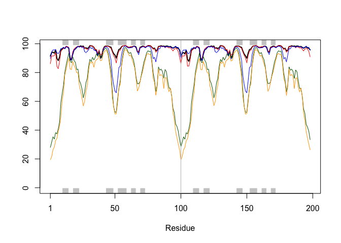
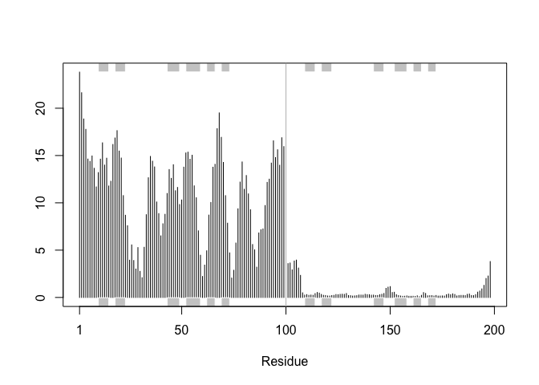
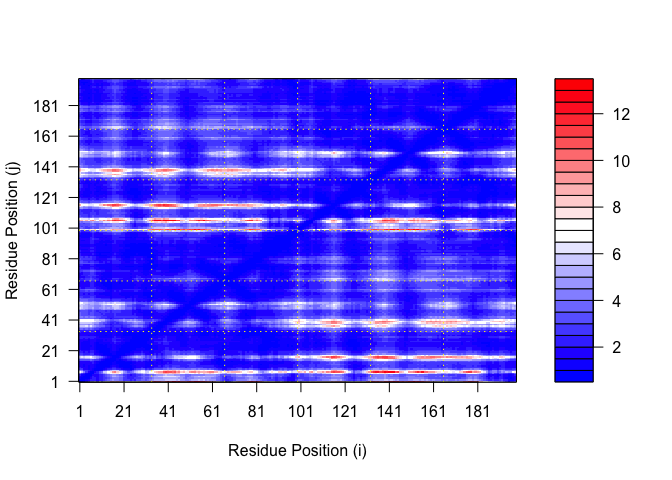
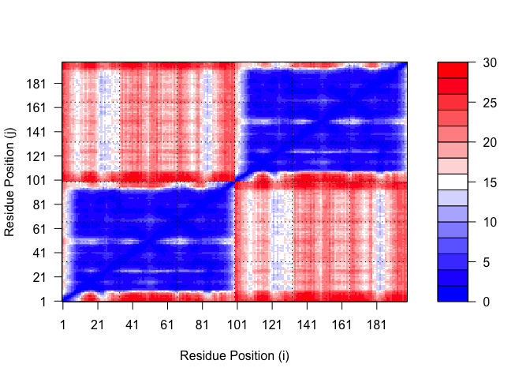

# Class11 Alphafold
Matthew Chan (A18130675)

## Background

In this hands-on session we will utilize AlphaFold to predict protein
structure from sequence (Jumper et al. 2021).

Without the aid of such approaches, it can take years of expensive
laboratory work to determine the structure of just one protein. With
AlphaFold we can now accurately compute a typical protein structure in
as little as ten minutes.

The PDB database (the main repository of experimental structures) only
has **~250 thousand structures** (we saw this in the last lab) . The
main protein sequence database has over **200 million** sequences ! Only
0.125% of known sequences have a known structure - this is called the
“structure knowledge gap”.

Structures are much harder to determine than sequences. They are
expensive (on average ~\$1 million each) They take on average 3-5 years
to solve!

## EBI Alphafold Database

The EBI has a database of pre-computed AlphaFold (AF) modules called
AFDB. This is growing all the time and can be useful to check before
running AF ourselves. \## Running Alphafold

We can download and run locally (on our own computers) but we need a
GPU. Or we can use “cloud” computing to run this on someone elses
computers

We will use ColabFold \< https://github.com/sokrypton/ColabFold \>

We previously found that there was no AFDB entry for our HIV sequence:

    >HIV-Pr-Dimer
    PQITLWQRPLVTIKIGGQLKEALLDTGADDTVLEEMSLPGRWKPKMIGGIGGFIKVRQYDQILIEICGHKAIGTVLVGPTPVNIIGRNLLTQIGCTLNF:PQITLWQRPLVTIKIGGQLKEALLDTGADDTVLEEMSLPGRWKPKMIGGIGGFIKVRQYDQILIEICGHKAIGTVLVGPTPVNIIGRNLLTQIGCTLNF

We will use AlphaFold2_mmseqs2

## 8 Custom analysis of resulting models

``` r
results_dir <- "hivpr_23119" 
```

``` r
pdb_files <- list.files(path=results_dir,
                        pattern="*.pdb",
                        full.names = TRUE)


basename(pdb_files)
```

    [1] "hivpr_23119_unrelaxed_rank_001_alphafold2_multimer_v3_model_4_seed_000.pdb"
    [2] "hivpr_23119_unrelaxed_rank_002_alphafold2_multimer_v3_model_1_seed_000.pdb"
    [3] "hivpr_23119_unrelaxed_rank_003_alphafold2_multimer_v3_model_5_seed_000.pdb"
    [4] "hivpr_23119_unrelaxed_rank_004_alphafold2_multimer_v3_model_2_seed_000.pdb"
    [5] "hivpr_23119_unrelaxed_rank_005_alphafold2_multimer_v3_model_3_seed_000.pdb"

``` r
library(bio3d)

# Read all data from Models 
#  and superpose/fit coords
pdbs <- pdbaln(pdb_files, fit=TRUE, exefile="msa")
```

    Reading PDB files:
    hivpr_23119/hivpr_23119_unrelaxed_rank_001_alphafold2_multimer_v3_model_4_seed_000.pdb
    hivpr_23119/hivpr_23119_unrelaxed_rank_002_alphafold2_multimer_v3_model_1_seed_000.pdb
    hivpr_23119/hivpr_23119_unrelaxed_rank_003_alphafold2_multimer_v3_model_5_seed_000.pdb
    hivpr_23119/hivpr_23119_unrelaxed_rank_004_alphafold2_multimer_v3_model_2_seed_000.pdb
    hivpr_23119/hivpr_23119_unrelaxed_rank_005_alphafold2_multimer_v3_model_3_seed_000.pdb
    .....

    Extracting sequences

    pdb/seq: 1   name: hivpr_23119/hivpr_23119_unrelaxed_rank_001_alphafold2_multimer_v3_model_4_seed_000.pdb 
    pdb/seq: 2   name: hivpr_23119/hivpr_23119_unrelaxed_rank_002_alphafold2_multimer_v3_model_1_seed_000.pdb 
    pdb/seq: 3   name: hivpr_23119/hivpr_23119_unrelaxed_rank_003_alphafold2_multimer_v3_model_5_seed_000.pdb 
    pdb/seq: 4   name: hivpr_23119/hivpr_23119_unrelaxed_rank_004_alphafold2_multimer_v3_model_2_seed_000.pdb 
    pdb/seq: 5   name: hivpr_23119/hivpr_23119_unrelaxed_rank_005_alphafold2_multimer_v3_model_3_seed_000.pdb 

``` r
rd <- rmsd(pdbs, fit=T)
```

    Warning in rmsd(pdbs, fit = T): No indices provided, using the 198 non NA positions

``` r
range(rd)
```

    [1]  0.000 14.428

``` r
library(pheatmap)

colnames(rd) <- paste0("m",1:5)
rownames(rd) <- paste0("m",1:5)
pheatmap(rd)
```


``` r
pdb <- read.pdb("1hsg")
```

      Note: Accessing on-line PDB file

``` r
plotb3(pdbs$b[1,], typ="l", lwd=2, sse=pdb)
points(pdbs$b[2,], typ="l", col="red")
points(pdbs$b[3,], typ="l", col="blue")
points(pdbs$b[4,], typ="l", col="darkgreen")
points(pdbs$b[5,], typ="l", col="orange")
abline(v=100, col="gray")
```



``` r
core <- core.find(pdbs)
```

     core size 197 of 198  vol = 8545.079 
     core size 196 of 198  vol = 7894.973 
     core size 195 of 198  vol = 3576.564 
     core size 194 of 198  vol = 1851.077 
     core size 193 of 198  vol = 1697.205 
     core size 192 of 198  vol = 1612.775 
     core size 191 of 198  vol = 1530.208 
     core size 190 of 198  vol = 1447.408 
     core size 189 of 198  vol = 1377.117 
     core size 188 of 198  vol = 1303.826 
     core size 187 of 198  vol = 1239.04 
     core size 186 of 198  vol = 1188.139 
     core size 185 of 198  vol = 1118.473 
     core size 184 of 198  vol = 1071.674 
     core size 183 of 198  vol = 1034.016 
     core size 182 of 198  vol = 980.836 
     core size 181 of 198  vol = 942.246 
     core size 180 of 198  vol = 911.395 
     core size 179 of 198  vol = 879.756 
     core size 178 of 198  vol = 834.466 
     core size 177 of 198  vol = 785.268 
     core size 176 of 198  vol = 762.122 
     core size 175 of 198  vol = 722.029 
     core size 174 of 198  vol = 700.395 
     core size 173 of 198  vol = 677.257 
     core size 172 of 198  vol = 657.81 
     core size 171 of 198  vol = 632.907 
     core size 170 of 198  vol = 614.198 
     core size 169 of 198  vol = 591.516 
     core size 168 of 198  vol = 573.979 
     core size 167 of 198  vol = 552.403 
     core size 166 of 198  vol = 529.489 
     core size 165 of 198  vol = 500.545 
     core size 164 of 198  vol = 482.517 
     core size 163 of 198  vol = 458.426 
     core size 162 of 198  vol = 444.455 
     core size 161 of 198  vol = 433.581 
     core size 160 of 198  vol = 419.086 
     core size 159 of 198  vol = 404.934 
     core size 158 of 198  vol = 393.803 
     core size 157 of 198  vol = 383.003 
     core size 156 of 198  vol = 366.654 
     core size 155 of 198  vol = 352.026 
     core size 154 of 198  vol = 335.663 
     core size 153 of 198  vol = 319.398 
     core size 152 of 198  vol = 307.935 
     core size 151 of 198  vol = 296.818 
     core size 150 of 198  vol = 284.289 
     core size 149 of 198  vol = 273.459 
     core size 148 of 198  vol = 261.978 
     core size 147 of 198  vol = 249.6 
     core size 146 of 198  vol = 237.954 
     core size 145 of 198  vol = 226.1 
     core size 144 of 198  vol = 213.265 
     core size 143 of 198  vol = 200.214 
     core size 142 of 198  vol = 187.504 
     core size 141 of 198  vol = 177.525 
     core size 140 of 198  vol = 167.372 
     core size 139 of 198  vol = 160.875 
     core size 138 of 198  vol = 154.455 
     core size 137 of 198  vol = 148.439 
     core size 136 of 198  vol = 142.13 
     core size 135 of 198  vol = 136.529 
     core size 134 of 198  vol = 130.77 
     core size 133 of 198  vol = 123.868 
     core size 132 of 198  vol = 117.609 
     core size 131 of 198  vol = 112.71 
     core size 130 of 198  vol = 106.361 
     core size 129 of 198  vol = 100.591 
     core size 128 of 198  vol = 95.718 
     core size 127 of 198  vol = 91.068 
     core size 126 of 198  vol = 86.862 
     core size 125 of 198  vol = 82.309 
     core size 124 of 198  vol = 78.554 
     core size 123 of 198  vol = 74.632 
     core size 122 of 198  vol = 70.489 
     core size 121 of 198  vol = 66.802 
     core size 120 of 198  vol = 62.901 
     core size 119 of 198  vol = 59.152 
     core size 118 of 198  vol = 55.75 
     core size 117 of 198  vol = 51.832 
     core size 116 of 198  vol = 48.3 
     core size 115 of 198  vol = 44.927 
     core size 114 of 198  vol = 42.418 
     core size 113 of 198  vol = 39.425 
     core size 112 of 198  vol = 37.381 
     core size 111 of 198  vol = 33.06 
     core size 110 of 198  vol = 28.153 
     core size 109 of 198  vol = 25.33 
     core size 108 of 198  vol = 22.509 
     core size 107 of 198  vol = 20.695 
     core size 106 of 198  vol = 18.754 
     core size 105 of 198  vol = 17.757 
     core size 104 of 198  vol = 16.712 
     core size 103 of 198  vol = 15.44 
     core size 102 of 198  vol = 14.745 
     core size 101 of 198  vol = 14.758 
     core size 100 of 198  vol = 13.11 
     core size 99 of 198  vol = 11.018 
     core size 98 of 198  vol = 8.967 
     core size 97 of 198  vol = 7.643 
     core size 96 of 198  vol = 6.326 
     core size 95 of 198  vol = 5.37 
     core size 94 of 198  vol = 4.312 
     core size 93 of 198  vol = 3.391 
     core size 92 of 198  vol = 2.697 
     core size 91 of 198  vol = 1.911 
     core size 90 of 198  vol = 1.577 
     core size 89 of 198  vol = 1.144 
     core size 88 of 198  vol = 0.826 
     core size 87 of 198  vol = 0.594 
     core size 86 of 198  vol = 0.494 
     FINISHED: Min vol ( 0.5 ) reached

``` r
core.inds <- print(core, vol=0.5)
```

    # 87 positions (cumulative volume <= 0.5 Angstrom^3) 
      start end length
    1     8  50     43
    2    52  95     44

``` r
xyz <- pdbfit(pdbs, core.inds, outpath="corefit_structures")
```

``` r
rf <- rmsf(xyz)

plotb3(rf, sse=pdb)
abline(v=100, col="gray", ylab="RMSF")
```



## 9 Predicted Alignment Error for domains

``` r
library(jsonlite)

pae_files <- list.files(path=results_dir,
                        pattern=".*model.*\\.json",
                        full.names = TRUE)
```

``` r
pae1 <- read_json(pae_files[1],simplifyVector = TRUE)
pae5 <- read_json(pae_files[5],simplifyVector = TRUE)

attributes(pae1)
```

    $names
    [1] "plddt"   "max_pae" "pae"     "ptm"     "iptm"   

``` r
head(pae1$plddt) 
```

    [1] 91.44 93.75 94.19 93.44 95.62 89.81

``` r
pae1$max_pae
```

    [1] 13.13281

``` r
pae5$max_pae
```

    [1] 29.71875

``` r
plot.dmat(pae1$pae, 
          xlab="Residue Position (i)",
          ylab="Residue Position (j)")
```



``` r
plot.dmat(pae5$pae, 
          xlab="Residue Position (i)",
          ylab="Residue Position (j)",
          grid.col = "black",
          zlim=c(0,30))
```



``` r
aln_file <- list.files(path=results_dir,
                       pattern=".a3m$",
                        full.names = TRUE)
aln_file
```

    [1] "hivpr_23119/hivpr_23119.a3m"

``` r
aln <- read.fasta(aln_file[1], to.upper = TRUE)
```

    [1] " ** Duplicated sequence id's: 101 **"
    [2] " ** Duplicated sequence id's: 101 **"

``` r
dim(aln$ali)
```

    [1] 5397  132

``` r
sim <- conserv(aln)

plotb3(sim[1:99], sse=trim.pdb(pdb, chain="A"),
       ylab="Conservation Score")
```


``` r
con <- consensus(aln, cutoff = 0.9)
con$seq
```

      [1] "-" "-" "-" "-" "-" "-" "-" "-" "-" "-" "-" "-" "-" "-" "-" "-" "-" "-"
     [19] "-" "-" "-" "-" "-" "-" "D" "T" "G" "A" "-" "-" "-" "-" "-" "-" "-" "-"
     [37] "-" "-" "-" "-" "-" "-" "-" "-" "-" "-" "-" "-" "-" "-" "-" "-" "-" "-"
     [55] "-" "-" "-" "-" "-" "-" "-" "-" "-" "-" "-" "-" "-" "-" "-" "-" "-" "-"
     [73] "-" "-" "-" "-" "-" "-" "-" "-" "-" "-" "-" "-" "-" "-" "-" "-" "-" "-"
     [91] "-" "-" "-" "-" "-" "-" "-" "-" "-" "-" "-" "-" "-" "-" "-" "-" "-" "-"
    [109] "-" "-" "-" "-" "-" "-" "-" "-" "-" "-" "-" "-" "-" "-" "-" "-" "-" "-"
    [127] "-" "-" "-" "-" "-" "-"

``` r
m1.pdb <- read.pdb(pdb_files[1])
occ <- vec2resno(c(sim[1:99], sim[1:99]), m1.pdb$atom$resno)
write.pdb(m1.pdb, o=occ, file="m1_conserv.pdb")
```

## Session Info

``` r
sessionInfo()
```

    R version 4.5.2 (2025-10-31)
    Platform: aarch64-apple-darwin20
    Running under: macOS Tahoe 26.1

    Matrix products: default
    BLAS:   /System/Library/Frameworks/Accelerate.framework/Versions/A/Frameworks/vecLib.framework/Versions/A/libBLAS.dylib 
    LAPACK: /Library/Frameworks/R.framework/Versions/4.5-arm64/Resources/lib/libRlapack.dylib;  LAPACK version 3.12.1

    locale:
    [1] en_US.UTF-8/en_US.UTF-8/en_US.UTF-8/C/en_US.UTF-8/en_US.UTF-8

    time zone: America/Los_Angeles
    tzcode source: internal

    attached base packages:
    [1] stats     graphics  grDevices utils     datasets  methods   base     

    other attached packages:
    [1] jsonlite_2.0.0  pheatmap_1.0.13 bio3d_2.4-5    

    loaded via a namespace (and not attached):
     [1] crayon_1.5.3        cli_3.6.5           knitr_1.51         
     [4] rlang_1.1.7         xfun_0.55           otel_0.2.0         
     [7] generics_0.1.4      glue_1.8.0          S4Vectors_0.48.0   
    [10] Biostrings_2.78.0   htmltools_0.5.9     stats4_4.5.2       
    [13] scales_1.4.0        rmarkdown_2.30      grid_4.5.2         
    [16] Seqinfo_1.0.0       evaluate_1.0.5      fastmap_1.2.0      
    [19] lifecycle_1.0.5     yaml_2.3.12         IRanges_2.44.0     
    [22] compiler_4.5.2      RColorBrewer_1.1-3  Rcpp_1.1.1         
    [25] XVector_0.50.0      rstudioapi_0.18.0   farver_2.1.2       
    [28] digest_0.6.39       R6_2.6.1            parallel_4.5.2     
    [31] gtable_0.3.6        tools_4.5.2         msa_1.42.0         
    [34] BiocGenerics_0.56.0
