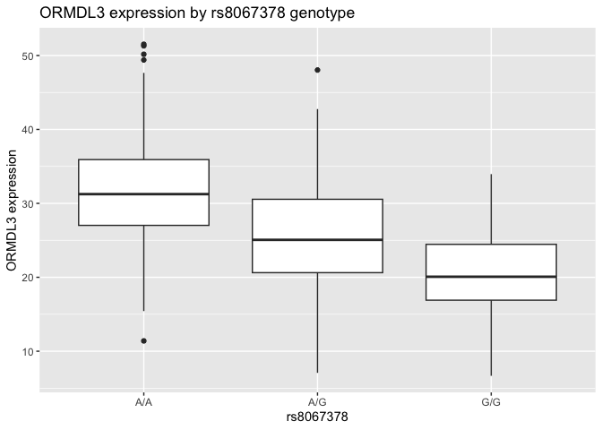

# Class12
Matthew Chan (A18130675)

## Section 2: Initial RNA-seq analysis

``` r
datatable <- read.table("rs8067378_ENSG00000172058.6.txt",
header = TRUE, stringsAsFactors = FALSE)
head(datatable)
```

       sample geno      exp
    1 HG00367  A/G 28.96038
    2 NA20768  A/G 20.24449
    3 HG00361  A/A 31.32628
    4 HG00135  A/A 34.11169
    5 NA18870  G/G 18.25141
    6 NA11993  A/A 32.89721

Sample size per genotype

``` r
n_genotype <- table(datatable$geno)
n_genotype
```


    A/A A/G G/G 
    108 233 121 

Median expression per genotype

``` r
median_genotype <- tapply(datatable$exp, datatable$geno, median, na.rm = TRUE)
median_genotype
```

         A/A      A/G      G/G 
    31.24847 25.06486 20.07363 

Boxplot

``` r
library(ggplot2)

ggplot(datatable, aes(x = geno, y = exp)) +
  geom_boxplot() +
  labs(
    x = "rs8067378",
    y = "ORMDL3 expression",
    title = "ORMDL3 expression by rs8067378 genotype"
  )
```


