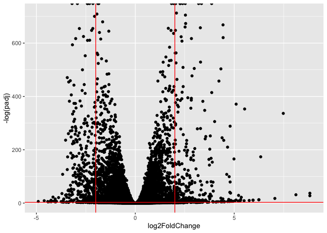
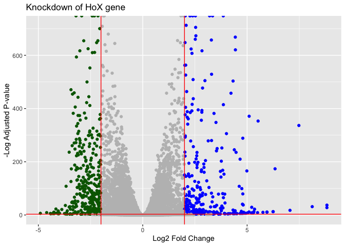
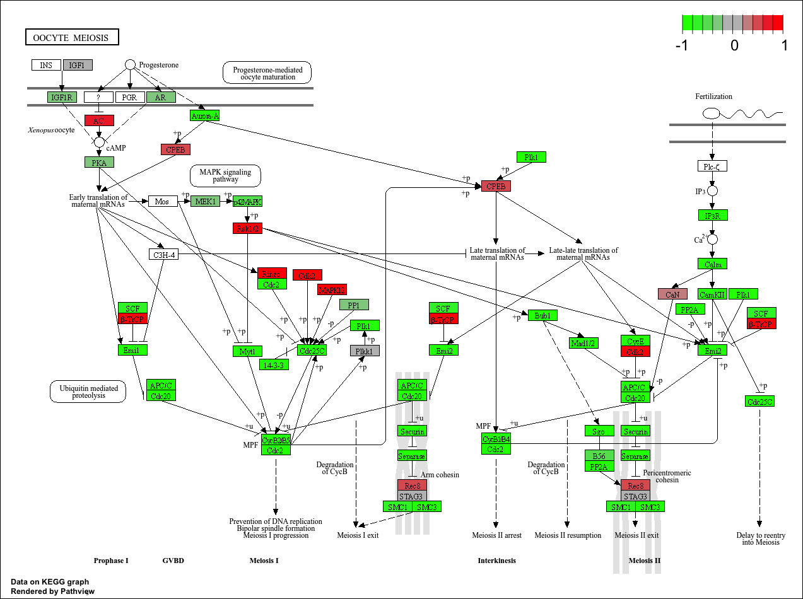
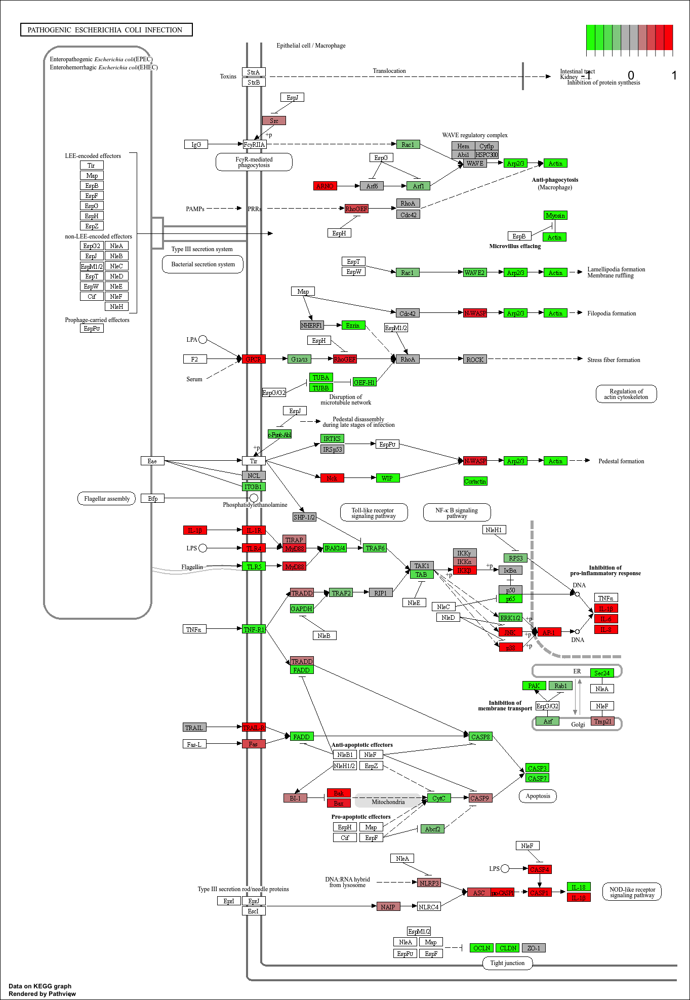

# Class 14: RNASeq Mini Project
Matthew Chan (A18130675)

- [Background](#background)
- [Data Import](#data-import)
  - [Cleanup (data tidying)](#cleanup-data-tidying)
- [DESeq Analysis](#deseq-analysis)
  - [Setting up the input object](#setting-up-the-input-object)
  - [Running DESeq](#running-deseq)
  - [Getting results](#getting-results)
- [Volcano Plot](#volcano-plot)
- [Add Annotation (gene symbols and entrez
  ids)](#add-annotation-gene-symbols-and-entrez-ids)
- [Pathway Analysis](#pathway-analysis)
  - [KEGG](#kegg)
  - [GO](#go)
  - [Reactome](#reactome)

## Background

The data for today’s mini-project comes from a knock-down study of an
important HoX gene

## Data Import

``` r
countFile <- "GSE37704_featurecounts.csv"
metaFile <- "GSE37704_metadata.csv"
countData <- read.csv(countFile, row.names=1)

colData <- read.csv(metaFile, row.names=1)
```

### Cleanup (data tidying)

``` r
countData <- countData[, -1]

to.keep <- rowSums(countData) > 10

countData <- countData[to.keep, ]
```

We need to remove the length column from our `countData` to make the
columns match the rows in `colData`

``` r
head(countData)
```

                    SRR493366 SRR493367 SRR493368 SRR493369 SRR493370 SRR493371
    ENSG00000279457        23        28        29        29        28        46
    ENSG00000187634       124       123       205       207       212       258
    ENSG00000188976      1637      1831      2383      1226      1326      1504
    ENSG00000187961       120       153       180       236       255       357
    ENSG00000187583        24        48        65        44        48        64
    ENSG00000187642         4         9        16        14        16        16

``` r
head(colData)
```

                  condition
    SRR493366 control_sirna
    SRR493367 control_sirna
    SRR493368 control_sirna
    SRR493369      hoxa1_kd
    SRR493370      hoxa1_kd
    SRR493371      hoxa1_kd

``` r
ncol(countData) == nrow(colData)
```

    [1] TRUE

## DESeq Analysis

``` r
library(DESeq2)
```

### Setting up the input object

``` r
dds <- DESeqDataSetFromMatrix(countData = countData,
                       colData = colData,
                       design = ~condition)
```

    Warning in DESeqDataSet(se, design = design, ignoreRank): some variables in
    design formula are characters, converting to factors

### Running DESeq

``` r
dds <- DESeq(dds)
```

    estimating size factors

    estimating dispersions

    gene-wise dispersion estimates

    mean-dispersion relationship

    final dispersion estimates

    fitting model and testing

### Getting results

``` r
res <- results(dds)
head(res)
```

    log2 fold change (MLE): condition hoxa1 kd vs control sirna 
    Wald test p-value: condition hoxa1 kd vs control sirna 
    DataFrame with 6 rows and 6 columns
                     baseMean log2FoldChange     lfcSE       stat      pvalue
                    <numeric>      <numeric> <numeric>  <numeric>   <numeric>
    ENSG00000279457   29.9120      0.1800352 0.3146287   0.572215 5.67176e-01
    ENSG00000187634  183.2182      0.4259359 0.1364245   3.122137 1.79543e-03
    ENSG00000188976 1651.1025     -0.6927959 0.0548876 -12.622082 1.59547e-36
    ENSG00000187961  209.6244      0.7298671 0.1285341   5.678394 1.35965e-08
    ENSG00000187583   47.2512      0.0395066 0.2628513   0.150300 8.80528e-01
    ENSG00000187642   11.9786      0.5401497 0.5043073   1.071073 2.84137e-01
                           padj
                      <numeric>
    ENSG00000279457 6.52317e-01
    ENSG00000187634 3.65952e-03
    ENSG00000188976 1.79740e-35
    ENSG00000187961 4.65764e-08
    ENSG00000187583 9.11673e-01
    ENSG00000187642 3.67241e-01

``` r
write.csv(res, "results.csv")
```

## Volcano Plot

``` r
library(ggplot2)

ggplot(res)+
  aes(log2FoldChange,
      -log(padj))+
  geom_point() +
  geom_vline(xintercept = c(-2,+2), col = "red") +
  geom_hline(yintercept = -log(0.05), col = "red")
```



``` r
mycols <- rep("gray", nrow(res) )
mycols[ res$log2FoldChange > 2] <- "blue"
mycols[ res$log2FoldChange < -2] <- "darkgreen"
mycols[res$padj >= 0.05] <- "gray"
```

``` r
ggplot(res)+
  aes(log2FoldChange,
      -log(padj) )+
  geom_point(col = mycols) +
  geom_vline(xintercept = c(-2,+2), col = "red") +
  geom_hline(yintercept = -log(0.05), col = "red") +
  labs(
    title = "Knockdown of HoX gene",
    x = "Log2 Fold Change",
    y = "-Log Adjusted P-value"
  ) 
```



## Add Annotation (gene symbols and entrez ids)

``` r
library(AnnotationDbi)
library(org.Hs.eg.db)
```

``` r
columns(org.Hs.eg.db)
```

     [1] "ACCNUM"       "ALIAS"        "ENSEMBL"      "ENSEMBLPROT"  "ENSEMBLTRANS"
     [6] "ENTREZID"     "ENZYME"       "EVIDENCE"     "EVIDENCEALL"  "GENENAME"    
    [11] "GENETYPE"     "GO"           "GOALL"        "IPI"          "MAP"         
    [16] "OMIM"         "ONTOLOGY"     "ONTOLOGYALL"  "PATH"         "PFAM"        
    [21] "PMID"         "PROSITE"      "REFSEQ"       "SYMBOL"       "UCSCKG"      
    [26] "UNIPROT"     

``` r
res$symbol <- mapIds(org.Hs.eg.db,
                    keys = rownames(res), # our ids
                    keytype = "ENSEMBL",# their format
                    column = "SYMBOL") # what i want to translate to
```

    'select()' returned 1:many mapping between keys and columns

``` r
res$entrez <- mapIds(org.Hs.eg.db,
                    keys = rownames(res), # our ids
                    keytype = "ENSEMBL",# their format
                    column = "ENTREZID") # what i want to translate to
```

    'select()' returned 1:many mapping between keys and columns

``` r
res$name <- mapIds(org.Hs.eg.db,
                    keys = rownames(res), # our ids
                    keytype = "ENSEMBL",# their format
                    column = "GENENAME") # what i want to translate to
```

    'select()' returned 1:many mapping between keys and columns

``` r
res = res[order(res$pvalue),]
write.csv(res, file="deseq_results.csv")

head(res)
```

    log2 fold change (MLE): condition hoxa1 kd vs control sirna 
    Wald test p-value: condition hoxa1 kd vs control sirna 
    DataFrame with 6 rows and 9 columns
                     baseMean log2FoldChange     lfcSE      stat    pvalue
                    <numeric>      <numeric> <numeric> <numeric> <numeric>
    ENSG00000117519   4483.44       -2.42277 0.0609018  -39.7816         0
    ENSG00000183508   2053.71        3.20181 0.0727131   44.0335         0
    ENSG00000159176   5692.21       -2.31380 0.0585392  -39.5256         0
    ENSG00000116016   4423.77       -1.88809 0.0440078  -42.9034         0
    ENSG00000164251   2348.58        3.34442 0.0694188   48.1775         0
    ENSG00000124766   2576.46        2.39219 0.0621624   38.4829         0
                         padj      symbol      entrez                   name
                    <numeric> <character> <character>            <character>
    ENSG00000117519         0        CNN3        1266             calponin 3
    ENSG00000183508         0      TENT5C       54855 terminal nucleotidyl..
    ENSG00000159176         0       CSRP1        1465 cysteine and glycine..
    ENSG00000116016         0       EPAS1        2034 endothelial PAS doma..
    ENSG00000164251         0       F2RL1        2150 F2R like trypsin rec..
    ENSG00000124766         0        SOX4        6659 SRY-box transcriptio..

## Pathway Analysis

``` r
library(gage)
library(gageData)
library(pathview)
```

``` r
foldchanges <- res$log2FoldChange
names(foldchanges) <- res$symbol
head(foldchanges)
```

         CNN3    TENT5C     CSRP1     EPAS1     F2RL1      SOX4 
    -2.422773  3.201809 -2.313796 -1.888087  3.344422  2.392190 

### KEGG

``` r
data(kegg.sets.hs)

names(foldchanges) <- res$entrez
keggres = gage(foldchanges, gsets=kegg.sets.hs)
head(keggres$less, 5)
```

                                                      p.geomean stat.mean
    hsa04110 Cell cycle                            3.941613e-06 -4.574837
    hsa03030 DNA replication                       6.465386e-05 -4.056695
    hsa04114 Oocyte meiosis                        2.652452e-04 -3.525658
    hsa05130 Pathogenic Escherichia coli infection 1.475737e-03 -3.061488
    hsa03440 Homologous recombination              2.650086e-03 -2.905934
                                                          p.val        q.val
    hsa04110 Cell cycle                            3.941613e-06 0.0008080306
    hsa03030 DNA replication                       6.465386e-05 0.0066270202
    hsa04114 Oocyte meiosis                        2.652452e-04 0.0181250900
    hsa05130 Pathogenic Escherichia coli infection 1.475737e-03 0.0756315398
    hsa03440 Homologous recombination              2.650086e-03 0.1086535414
                                                   set.size         exp1
    hsa04110 Cell cycle                                 118 3.941613e-06
    hsa03030 DNA replication                             36 6.465386e-05
    hsa04114 Oocyte meiosis                              96 2.652452e-04
    hsa05130 Pathogenic Escherichia coli infection       47 1.475737e-03
    hsa03440 Homologous recombination                    28 2.650086e-03

``` r
pathview(foldchanges, pathway.id = "hsa04110")
```

    'select()' returned 1:1 mapping between keys and columns

    Info: Working in directory /Users/matthewchan/Downloads/UCSD Winter 2026/BIMM 143 Grant/bimm143_github_redo/Class14

    Info: Writing image file hsa04110.pathview.png

``` r
pathview(foldchanges, pathway.id = "hsa04114")
```

    'select()' returned 1:1 mapping between keys and columns

    Info: Working in directory /Users/matthewchan/Downloads/UCSD Winter 2026/BIMM 143 Grant/bimm143_github_redo/Class14

    Info: Writing image file hsa04114.pathview.png

``` r
pathview(foldchanges, pathway.id = "hsa03030")
```

    'select()' returned 1:1 mapping between keys and columns

    Info: Working in directory /Users/matthewchan/Downloads/UCSD Winter 2026/BIMM 143 Grant/bimm143_github_redo/Class14

    Info: Writing image file hsa03030.pathview.png

``` r
pathview(foldchanges, pathway.id = "hsa05130")
```

    'select()' returned 1:1 mapping between keys and columns

    Info: Working in directory /Users/matthewchan/Downloads/UCSD Winter 2026/BIMM 143 Grant/bimm143_github_redo/Class14

    Info: Writing image file hsa05130.pathview.png

``` r
pathview(foldchanges, pathway.id = "hsa03440")
```

    'select()' returned 1:1 mapping between keys and columns

    Info: Working in directory /Users/matthewchan/Downloads/UCSD Winter 2026/BIMM 143 Grant/bimm143_github_redo/Class14

    Info: Writing image file hsa03440.pathview.png

 
 


### GO

``` r
data(go.sets.hs)
data(go.subs.hs)

gobpsets = go.sets.hs[go.subs.hs$BP]

gobpres = gage(foldchanges, gsets=gobpsets)

head(gobpres$less)
```

                                                p.geomean stat.mean        p.val
    GO:0000279 M phase                       7.872424e-18 -8.703162 7.872424e-18
    GO:0048285 organelle fission             3.290213e-16 -8.280327 3.290213e-16
    GO:0000280 nuclear division              4.770051e-16 -8.246772 4.770051e-16
    GO:0007067 mitosis                       4.770051e-16 -8.246772 4.770051e-16
    GO:0000087 M phase of mitotic cell cycle 1.527703e-15 -8.085992 1.527703e-15
    GO:0007059 chromosome segregation        4.670592e-12 -7.144730 4.670592e-12
                                                    q.val set.size         exp1
    GO:0000279 M phase                       2.994670e-14      469 7.872424e-18
    GO:0048285 organelle fission             4.536319e-13      362 3.290213e-16
    GO:0000280 nuclear division              4.536319e-13      340 4.770051e-16
    GO:0007067 mitosis                       4.536319e-13      340 4.770051e-16
    GO:0000087 M phase of mitotic cell cycle 1.162276e-12      350 1.527703e-15
    GO:0007059 chromosome segregation        2.961155e-09      135 4.670592e-12

### Reactome

``` r
sig_genes <- res[res$padj <= 0.05 & !is.na(res$padj), "symbol"]
print(paste("Total number of significant genes:", length(sig_genes)))
```

    [1] "Total number of significant genes: 8288"

``` r
write.table(sig_genes, file="significant_genes.txt", row.names=FALSE, col.names=FALSE, quote=FALSE)
```

> Q: What pathway has the most significant “Entities p-value”? Do the
> most significant pathways listed match your previous KEGG results?
> What factors could cause differences between the two methods?

Cell Cycle Mitotic, The most significant pathways more or less match up
with the previous KEGG results. Something that might cause differences
between the two methods is how the two methods group results and
differences and how specific they are. In KEGG cell cycle is just one
result whereas in Reactome its split into many.
