# Q1
> Tell me the name of a protein you are interested in. Include the species and the accession number. This can be a human protein or a protein from any other species as long as it's function is known. If you do not have a favorite protein, select human RBP4 or KIF11. Do not use beta globin as this is in the worked example report that I provide you with online.

 **Name:** retinol-binding protein 4 isoform b
 
 **Accession:** NP_001310447
 
 **Species** Homo Sapiens
 
 **Function:**
 enables molecular carrier activity	IEA	 
enables protein binding	IPI	PubMed 
enables protein-containing complex binding	IEA	 
enables retinal binding	IEA	 
enables retinoid binding	IEA	 
enables retinol binding	IBA	 
enables retinol binding	IDA	PubMed 
enables retinol binding	IEA	 
enables retinol transmembrane transporter activity	IC	PubMed 
enables retinol transmembrane transporter activity IEA
 
# Q2
> Perform a BLAST search against a DNA database, such as a database consisting of genomic DNA or ESTs. The BLAST server can be at NCBI or elsewhere. Include details of the BLAST method used, database searched and any limits applied (e.g. Organism).

 **Method:** TBLASTN 2.17.0+

 **Database:** Expressed Sequence Tags (est)

 **Organism:** Macaca mulatta (taxid:9544)
 
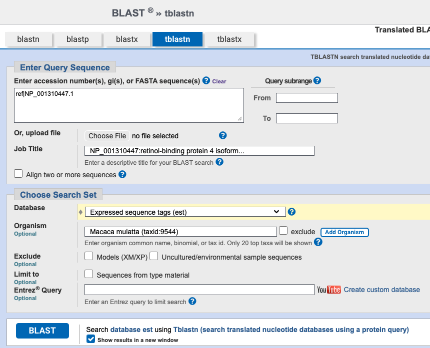


**Chosen match**: Accession DR774611.1, a 844 bp mRNA sequence from Macaca mulatta


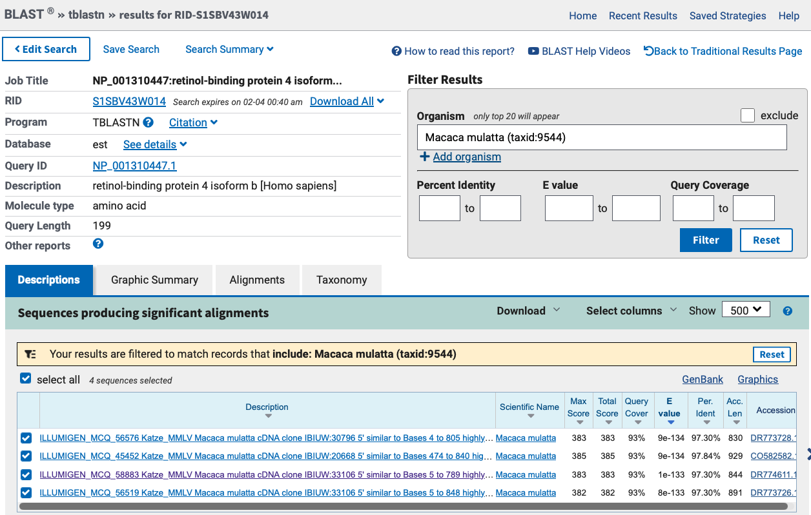
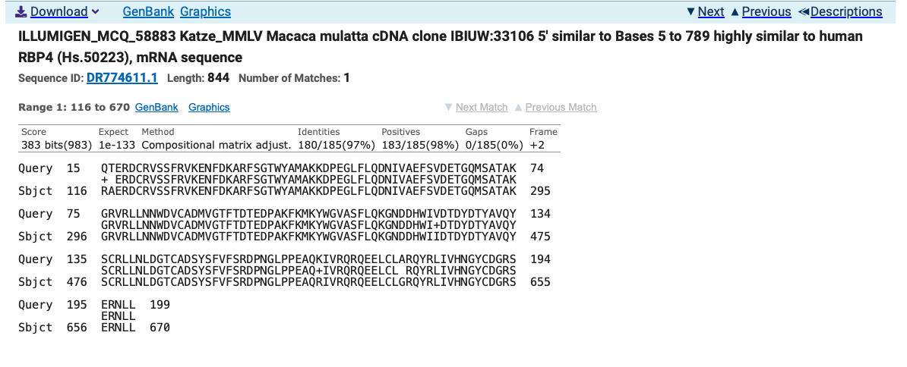

## Alignment details:
```text
ILLUMIGEN_MCQ_58883 Katze_MMLV Macaca mulatta cDNA clone IBIUW:33106 5' similar 
to Bases 5 to 789 highly similar to human RBP4 (Hs.50223), mRNA sequence
Sequence ID: DR774611.1 Length: 844 Number of Matches: 1
Range 1: 116 to 670GenBankGraphicsNext MatchPrevious Match
Alignment statistics for match #1
Score	Expect	Method	Identities	Positives	Gaps
Frame
383 bits(983)	1e-133	Compositional matrix adjust.	180/185(97%)	183/185(98%)	0/185(0%)
+2
Query  15   QTERDCRVSSFRVKENFDKARFSGTWYAMAKKDPEGLFLQDNIVAEFSVDETGQMSATAK  74
            + ERDCRVSSFRVKENFDKARFSGTWYAMAKKDPEGLFLQDNIVAEFSVDETGQMSATAK
Sbjct  116  RAERDCRVSSFRVKENFDKARFSGTWYAMAKKDPEGLFLQDNIVAEFSVDETGQMSATAK  295

Query  75   GRVRLLNNWDVCADMVGTFTDTEDPAKFKMKYWGVASFLQKGNDDHWIVDTDYDTYAVQY  134
            GRVRLLNNWDVCADMVGTFTDTEDPAKFKMKYWGVASFLQKGNDDHWI+DTDYDTYAVQY
Sbjct  296  GRVRLLNNWDVCADMVGTFTDTEDPAKFKMKYWGVASFLQKGNDDHWIIDTDYDTYAVQY  475

Query  135  SCRLLNLDGTCADSYSFVFSRDPNGLPPEAQKIVRQRQEELCLARQYRLIVHNGYCDGRS  194
            SCRLLNLDGTCADSYSFVFSRDPNGLPPEAQ+IVRQRQEELCL RQYRLIVHNGYCDGRS
Sbjct  476  SCRLLNLDGTCADSYSFVFSRDPNGLPPEAQRIVRQRQEELCLGRQYRLIVHNGYCDGRS  655

Query  195  ERNLL  199
            ERNLL
Sbjct  656  ERNLL  670
```

# Q3
> Gather information about this “novel” protein. At a minimum, show me the protein sequence of the “novel” protein as displayed in your BLAST results from [Q2] as FASTA format (you can copy and paste the aligned sequence subject lines from your BLAST result page if necessary) or translate your novel DNA sequence using a tool called EMBOSS Transeq at the EBI. Don’t forget to translate all six reading frames; the ORF (open reading frame) is likely to be the longest sequence without a stop codon. It may not start with a methionine if you don’t have the complete coding region. Make sure the sequence you provide includes a header/subject line and is in traditional FASTA format 


## Chosen Sequence
## Fasta Format (sequence taken from BLAST result)
```fasta
>ILLUMIGEN_MCQ_58883 Katze_MMLV Macaca mulatta cDNA clone
RAERDCRVSSFRVKENFDKARFSGTWYAMAKKDPEGLFLQDNIVAEFSVDETGQMSATAKGRVRLLNNWD
VCADMVGTFTDTEDPAKFKMKYWGVASFLQKGNDDHWIIDTDYDTYAVQYSCRLLNLDGTCADSYSFVFS
RDPNGLPPEAQRIVRQRQEELCLGRQYRLIVHNGYCDGRSERNLL
```

**Name:** ILLUMIGEN_MCQ_58883 Katze_MMLV Macaca mulatta cDNA clone 

**Species:** Macaca Mulatta
  

# Q4
> Prove that this gene, and its corresponding protein, are novel. For the purposes of this project, “novel” is defined as follows. Take the protein sequence (your answer to [Q3]), and use it as a query in a blastp search of the nr database at NCBI.
• If there is a match with 100% amino acid identity to a protein in the database, from the same species, then your protein is NOT novel (even if the match is to a protein with a name such as “unknown”). Someone has already found and annotated this sequence, and assigned it an accession number.
• If the top match reported has less than 100% identity, then it is likely that your protein is novel, and you have succeeded.
• If there is a match with 100% identity, but to a different species than the one you started with, then you have likely succeeded in finding a novel gene.
• If there are no database matches to the original query from [Q1], this indicates that you have partially succeeded: yes, you may have found a new gene, but no, it is not actually homologous to the original query. You should probably start over.
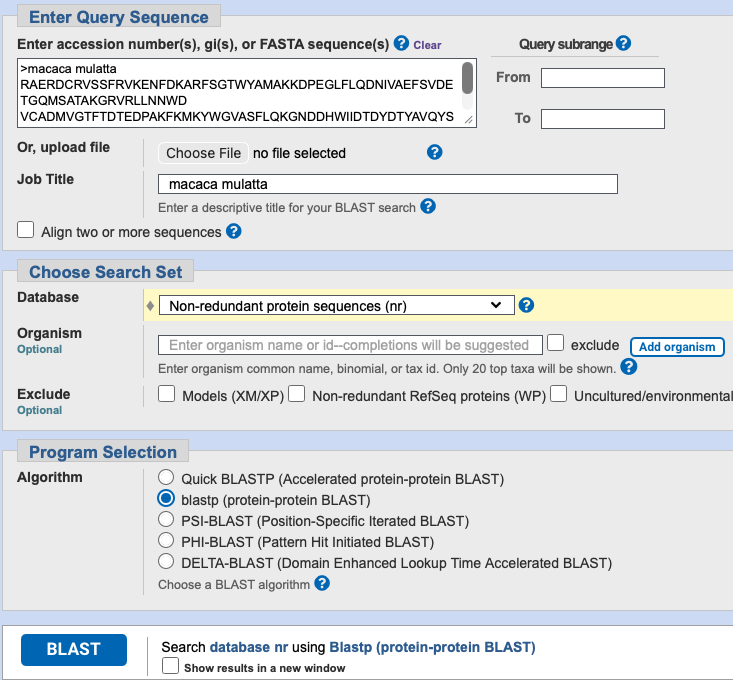
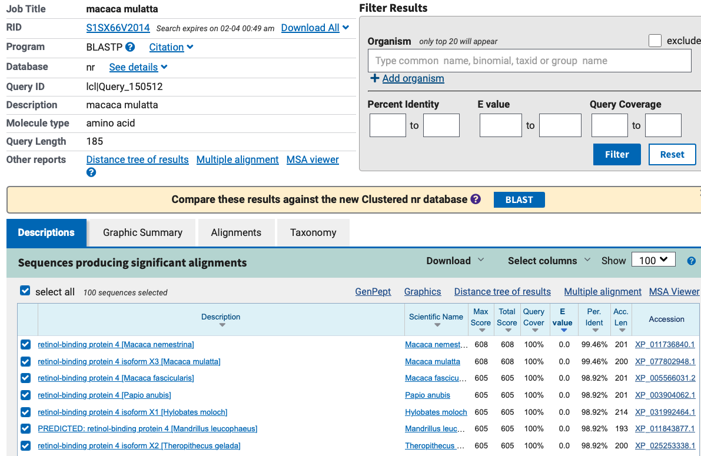
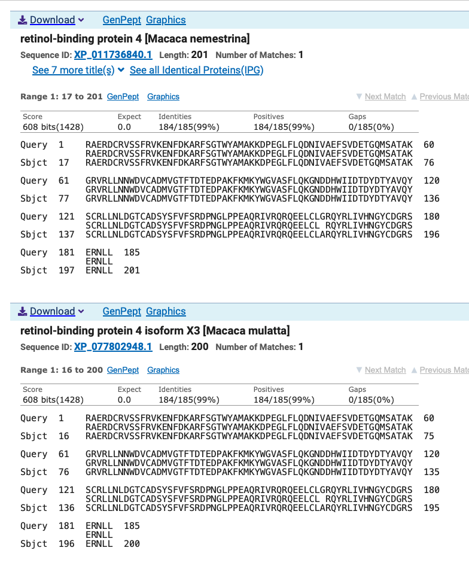

# Q5
> Generate a multiple sequence alignment with your novel protein, your original query protein, and a group of other members of this family from different species. A typical number of proteins to use in a multiple sequence alignment for this assignment purpose is a minimum of 5 and a maximum of 20 - although the exact number is up to you. Include the multiple sequence alignment in your report. Use Courier font with a size appropriate to fit page width.
Side-note: Indicate your sequence in the alignment by choosing an appropriate name for each sequence in the input unaligned sequence file (i.e. edit the sequence file so that the species, or short common, names (rather than accession numbers) display in the output alignment and in the subsequent answers below). The goal in this step is to create an interesting an alignment for building a phylogenetic tree that illustrates species divergence.

Re-labeled sequences for alignment
```fasta
>novel_protein ILLUMIGEN_MCQ_58883 Katze_MMLV Macaca mulatta cDNA clone
RAERDCRVSSFRVKENFDKARFSGTWYAMAKKDPEGLFLQDNIVAEFSVDETGQMSATAKGRVRLLNNWDVCADMVGTFT
DTEDPAKFKMKYWGVASFLQKGNDDHWIIDTDYDTYAVQYSCRLLNLDGTCADSYSFVFSRDPNGLPPEAQRIVRQRQEE
LCLGRQYRLIVHNGYCDGRSERNLL

>original_query NP_001310447.1 retinol-binding protein 4 isoform b [Homo sapiens]
QTERDCRVSSFRVKENFDKARFSGTWYAMAKKDPEGLFLQDNIVAEFSVDETGQMSATAKGRVRLLNNWDVCADMVGTFT
DTEDPAKFKMKYWGVASFLQKGNDDHWIVDTDYDTYAVQYSCRLLNLDGTCADSYSFVFSRDPNGLPPEAQKIVRQRQEE
LCLARQYRLIVHNGYCDGRSERNLL

>Rhesus_monkey XP_077802948.1 retinol-binding protein 4 isoform X3 [Macaca mulatta]
RAERDCRVSSFRVKENFDKARFSGTWYAMAKKDPEGLFLQDNIVAEFSVDETGQMSATAKGRVRLLNNWDVCADMVGTFT
DTEDPAKFKMKYWGVASFLQKGNDDHWIIDTDYDTYAVQYSCRLLNLDGTCADSYSFVFSRDPNGLPPEAQRIVRQRQEE
LCLARQYRLIVHNGYCDGRSERNLL

>Olive_baboon XP_003904062.1 retinol-binding protein 4 [Papio anubis]
RAERDCRVSSFRVKENFDKARFSGTWYAMAKKDPEGLFLQDNIVAEFSVDETGQMSATAKGRVRLLNNWDVCADMVGTFT
DTEDPAKFKMKYWGVASFLQKGNDDHWIIDTDYDTYAVQYSCRLLNLDGTCADSYSFVFSRDPNGLPPEAQKIVRQRQEE
LCLARQYRLIVHNGYCDGRSERNLL

>Silvery_gibbon XP_031992464.1 retinol-binding protein 4 isoform X1 [Hylobates moloch]
RAERDCRVSSFRVKENFDKARFSGTWYAMAKKDPEGLFLQDNIVAEFSVDETGQMSATAKGRVRLLNNWDVCADMVGTFT
DTEDPAKFKMKYWGVASFLQKGNDDHWIIDTDYDTYAVQYSCRLLNLDGTCADSYSFVFSRDPNGLPPEAQKIVRQRQEE
LCLARQYRLIVHNGYCDGRSERNLL

>Ma_night_monkey XP_012310228.1 retinol-binding protein 4 isoform X2 [Aotus nancymaae]
RAERDCRVSSFRVKENFDKARFSGTWYAMAKKDPEGLFLQDNIVAEFSVDETGQMSATAKGRVRLLNNWDVCADMVGTFT
DTEDPAKFKMKYWGVASFLQKGNDDHWIVDTDYDTYAVQYSCRLLNLDGTCADSYSFVFSRDPNGLPPEAQRIIRQRQEE
LCLARQYRLIVHNGYCDGKSERNLL

>White_tufted_ear_marmoset XP_035124385.2 retinol-binding protein 4 isoform X1 [Callithrix jacchus]
RAERDCRVSSFRVKENFDKARFSGTWYAMAKKDPEGLFLQDNIIAEFSVDETGQMSATAKGRVRLLNNWDVCADMVGTFT
DTEDPAKFKMKYWGVASFLQKGNDDHWIIDTDYDTYAVQYSCRLLNLDGTCADSYSFVFSRDPNGLPPEAQRIIRQRQEE
LCLARQYRLIVHNGYCDGKSERNLL

>Western_lowland_gorilla XP_018890983.3 retinol-binding protein 4 [Gorilla gorilla gorilla]
RAERDCRVSSFRVKENFDKARFSGTWYAMAKKDPEGLFLQDNIVAEFSVDETGQMSATAKGRVRLLNNWDVCADMVGTFT
DTEDPAKFKMKYWGVASFLQKGNDDHWIVDTDYDTYAVQYSCRLLNLDGTCADSYSFVFSRDPNGLPPEAQKIVRQRQEE
LCLARQYRLIVHNGYCDGRSERNLL
```

Alignment
```{=latex}
{\fontsize{10}{12}\selectfont\fontfamily{pcr}\selectfont
\begin{verbatim}
CLUSTAL multiple sequence alignment by MUSCLE (3.8)


Ma_night_monkey                RAERDCRVSSFRVKENFDKARFSGTWYAMAKKDPEGLFLQDNIVAEFSVDETGQMSATAK
White_tufted_ear_marmoset      RAERDCRVSSFRVKENFDKARFSGTWYAMAKKDPEGLFLQDNIIAEFSVDETGQMSATAK
original_query                 QTERDCRVSSFRVKENFDKARFSGTWYAMAKKDPEGLFLQDNIVAEFSVDETGQMSATAK
Western_lowland_gorilla        RAERDCRVSSFRVKENFDKARFSGTWYAMAKKDPEGLFLQDNIVAEFSVDETGQMSATAK
Olive_baboon                   RAERDCRVSSFRVKENFDKARFSGTWYAMAKKDPEGLFLQDNIVAEFSVDETGQMSATAK
Silvery_gibbon                 RAERDCRVSSFRVKENFDKARFSGTWYAMAKKDPEGLFLQDNIVAEFSVDETGQMSATAK
novel_protein                  RAERDCRVSSFRVKENFDKARFSGTWYAMAKKDPEGLFLQDNIVAEFSVDETGQMSATAK
Rhesus_monkey                  RAERDCRVSSFRVKENFDKARFSGTWYAMAKKDPEGLFLQDNIVAEFSVDETGQMSATAK
                               .:*****************************************:****************

Ma_night_monkey                GRVRLLNNWDVCADMVGTFTDTEDPAKFKMKYWGVASFLQKGNDDHWIVDTDYDTYAVQY
White_tufted_ear_marmoset      GRVRLLNNWDVCADMVGTFTDTEDPAKFKMKYWGVASFLQKGNDDHWIIDTDYDTYAVQY
original_query                 GRVRLLNNWDVCADMVGTFTDTEDPAKFKMKYWGVASFLQKGNDDHWIVDTDYDTYAVQY
Western_lowland_gorilla        GRVRLLNNWDVCADMVGTFTDTEDPAKFKMKYWGVASFLQKGNDDHWIVDTDYDTYAVQY
Olive_baboon                   GRVRLLNNWDVCADMVGTFTDTEDPAKFKMKYWGVASFLQKGNDDHWIIDTDYDTYAVQY
Silvery_gibbon                 GRVRLLNNWDVCADMVGTFTDTEDPAKFKMKYWGVASFLQKGNDDHWIIDTDYDTYAVQY
novel_protein                  GRVRLLNNWDVCADMVGTFTDTEDPAKFKMKYWGVASFLQKGNDDHWIIDTDYDTYAVQY
Rhesus_monkey                  GRVRLLNNWDVCADMVGTFTDTEDPAKFKMKYWGVASFLQKGNDDHWIIDTDYDTYAVQY
                               ************************************************:***********

Ma_night_monkey                SCRLLNLDGTCADSYSFVFSRDPNGLPPEAQRIIRQRQEELCLARQYRLIVHNGYCDGKS
White_tufted_ear_marmoset      SCRLLNLDGTCADSYSFVFSRDPNGLPPEAQRIIRQRQEELCLARQYRLIVHNGYCDGKS
original_query                 SCRLLNLDGTCADSYSFVFSRDPNGLPPEAQKIVRQRQEELCLARQYRLIVHNGYCDGRS
Western_lowland_gorilla        SCRLLNLDGTCADSYSFVFSRDPNGLPPEAQKIVRQRQEELCLARQYRLIVHNGYCDGRS
Olive_baboon                   SCRLLNLDGTCADSYSFVFSRDPNGLPPEAQKIVRQRQEELCLARQYRLIVHNGYCDGRS
Silvery_gibbon                 SCRLLNLDGTCADSYSFVFSRDPNGLPPEAQKIVRQRQEELCLARQYRLIVHNGYCDGRS
novel_protein                  SCRLLNLDGTCADSYSFVFSRDPNGLPPEAQRIVRQRQEELCLGRQYRLIVHNGYCDGRS
Rhesus_monkey                  SCRLLNLDGTCADSYSFVFSRDPNGLPPEAQRIVRQRQEELCLARQYRLIVHNGYCDGRS
                               *******************************.*:*********.**************.*

Ma_night_monkey                ERNLL
White_tufted_ear_marmoset      ERNLL
original_query                 ERNLL
Western_lowland_gorilla        ERNLL
Olive_baboon                   ERNLL
Silvery_gibbon                 ERNLL
novel_protein                  ERNLL
Rhesus_monkey                  ERNLL
                               *****
...
\end{verbatim}
}
```
                   
# Q6
> Create a phylogenetic tree, using either a parsimony or distance-based approach.
Bootstrapping and tree rooting are optional. Use “simple phylogeny” online from the EBI
or any respected phylogeny program (such as MEGA, PAUP, or Phylip). Paste an image
of your Cladogram or tree output in your report.

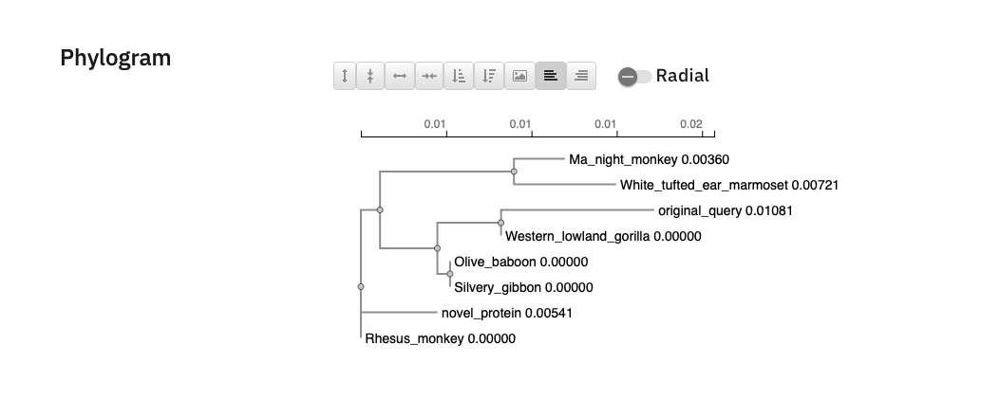

# Q7
> Generate a sequence identity based heatmap of your aligned sequences using R. If necessary convert your sequence alignment to the ubiquitous FASTA format (Seaview can read in clustal format and “Save as” FASTA format for example). Read this FASTA format alignment into R with the help of functions in the Bio3D package. Calculate a
sequence identity matrix (again using a function within the Bio3D package). Then generate a heatmap plot and add to your report. Do make sure your labels are visible and not cut at the figure margins.

```{r}
library(bio3d)
library(pheatmap)

aln_file <- "findagenemsa.aln-fasta"
aln_file

aln <- read.fasta(aln_file, to.upper = TRUE)

seqidmat <- seqidentity(aln)

rownames(seqidmat) <- aln$id
colnames(seqidmat) <- aln$id

pheatmap(seqidmat)
```

# Q8
> Using R/Bio3D (or an online blast server if you prefer), search the main protein structure database for the most similar atomic resolution structures to your aligned sequences.
List the top 3 unique hits (i.e. not hits representing different chains from the same structure) along with their Evalue and sequence identity to your query. Please also add annotation details of these structures. For example include the annotation terms PDB identifier (structureId), Method used to solve the structure (experimentalTechnique), resolution (resolution), and source organism (source).
HINT: You can use a single sequence from your alignment or generate a consensus sequence from your alignment using the Bio3D function consensus(). The Bio3D functions blast.pdb(), plot.blast() and pdb.annotate() are likely to be of most relevance
for completing this task. Note that the results of blast.pdb() contain the hits PDB identifier (or pdb.id) as well as Evalue and identity. The results of pdb.annotate() contain the other annotation terms noted above.
Note that if your consensus sequence has lots of gap positions then it will be better to use an original sequence from the alignment for your search of the PDB. In this case you could chose the sequence with the highest identity to all others in your alignment by calculating the row-wise maximum from your sequence identity matrix.

```{r}
# consensusseq <- consensus(aln)
# did not use because of gaps

diag(seqidmat) <- NA
rowmean <- apply(seqidmat, 1, mean, na.rm = TRUE)
best_seq <- names(which.max(rowmean))
best_seq

i <- which(aln$id == best_seq)
novel <- aln$ali[i, ]
novel_seq <- paste(novel[novel != "-"], collapse = "")

# run PDB BLAST
hits <- blast.pdb(novel_seq)
```

```{r}
id1 <- "4O9S_A"
id2 <- "1HBQ_A"
id3 <- "1RLB_E"

ann1 <- pdb.annotate(id1)
ann2 <- pdb.annotate(id2)
ann3 <- pdb.annotate(id3)

finaltable <- data.frame(
  ID = c("4O9S_A", "1HBQ_A", "1RLB_E"),
  Technique = c(
    ann1$experimentalTechnique[1],
    ann2$experimentalTechnique[1],
    ann3$experimentalTechnique[1]
  ),
  Resolution = c(
    ann1$resolution[1],
    ann2$resolution[1],
    ann3$resolution[1]
  ),
  Source = c(
    ann1$source[1],
    ann2$source[1],
    ann3$source[1]
  ),
  Evalue = c(2.13e-138, 6.99e-130	, 2.39e-123),
  Identity = c(98.907, 92.350, 92.529)
)

finaltable
```

# Q9
> Using AlphaFold notebook generate a structural model using the default parameters for your novel protein sequence.
Note that this can take some time depending upon your sequence length. If your model is taking many hours to generate or your input sequence yields a “too many amino acids” (i.e. length) error you can focus on a single domain from your sequence - identify region by searching for PFAM domain matches.
Once complete save the resulting PDB format file for your records. Finally, generate a molecular figure of your generated PDB structure using the Mol* viewer online (or VMD/PyMol/Chimera if you prefer). To complete your analysis you should highlight
conserved residues that are likely to be functional as spacefill and the protein as cartoon colored by local alpha fold pLDDT quality score. You can determine conserved residues from the alignment generated by the AlphaFold server and use a conservation
cutoff appropriate for the diversity of your protein alignment (e.g. between 60% and 99% conserved). Note that pLDDT score is contained in the B-factor column of your PDB downloaded file. Please use a white or transparent background for your figure (i.e. not the default black in PyMol/VMD/Chimera etc.).

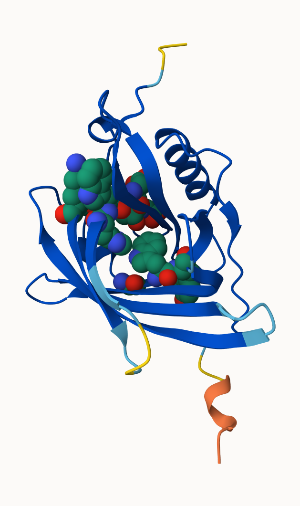

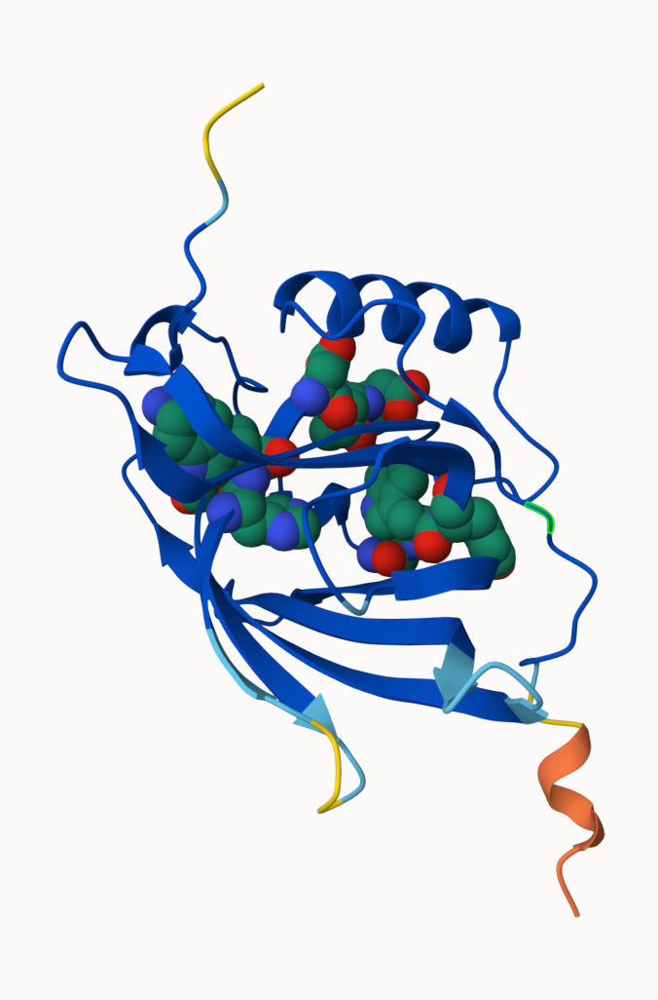

# Q10
>(i) Using your computed structure model (or your closest homologue of known
structure from the PDB) predict and locate potential small molecule binding sites using
the CASTpFold server ( https://cfold.bme.uic.edu/castpfold/ ). Provide an image or
screen-shot of your largest predicted pockets “negative volume” and provide it’s area
and volume.

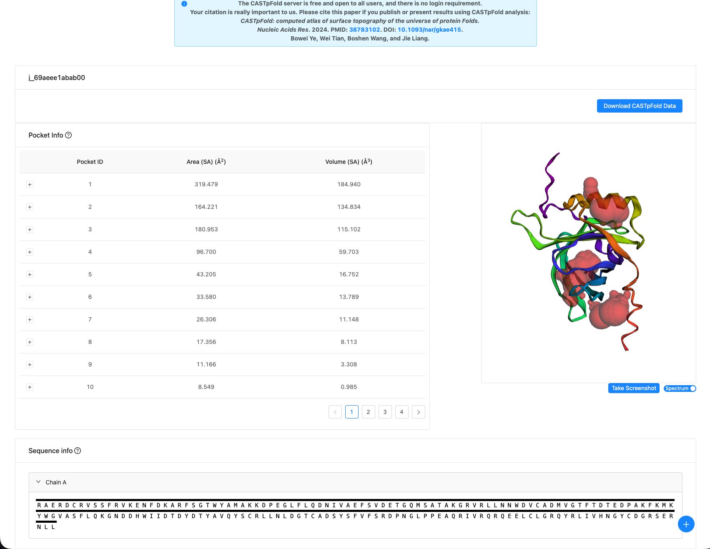
Largest predicted pocket area: 319.479 Å^2
Largest predicted pocket volume: 189.940 Å^3

>(ii) Perform a “Target” search of ChEMBEL ( https://www.ebi.ac.uk/chembl/ ) with your novel sequence. Are there any Target Associated Assays and ligand efficiency data reported that may be useful starting points for exploring potential inhibition of your novel protein? If there are no assays listed here simply list “non available as of [date]”.

There were a few results from the Target search of ChEMBEL with the notable one being the homo-sapien Retinol-binding protein 4 with a 4.1e-139 e-value and a 99.5% positives. When clicking into Target CHEMBL3100 (Retinol-binding protein 4), you find that 29, or 90.63% of associated assays are for binding and that there is ligand efficiency data. The point that has the highest surface efficiency index and binding efficiency index value is retinol. 

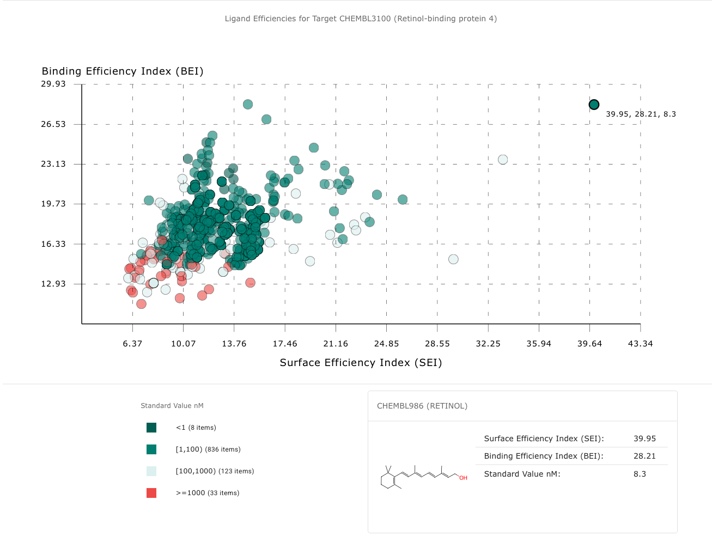

>(iii) Briefly discuss (100 words max) the druggability of your novel protein based on:
- Presence of well-defined pockets (output of tools like CASTpFold),
- Existence of known inhibitors for related proteins (your search of ChEMBEL),
- Conservation of binding sites across homologs (your conservation analysis in Q10),
- Potential therapeutic applications if this protein were targeted (you can use ChatGPT,
Claude etc. backed up by your reading of the literature here).

The protein is most likely druggable based on the presence of at least one distinct large pocket from the CASTpFold tool that defined a pocket area of 319.479 Å^2 and a pocket volume of 189.940 Å^3. The search in ChEMBEL also yielded results for binding assays and ligand-efficiency, which shows that ligands/molecules may bind to this protein. Conserved residues on this protein also indicate that certain residues may serve a functional purpose for the protein. In terms of therapy, retinol binding proteins oftern serve in metabolic signaling, so this protein may have an influence in metabolic disorders like diabetes.  

